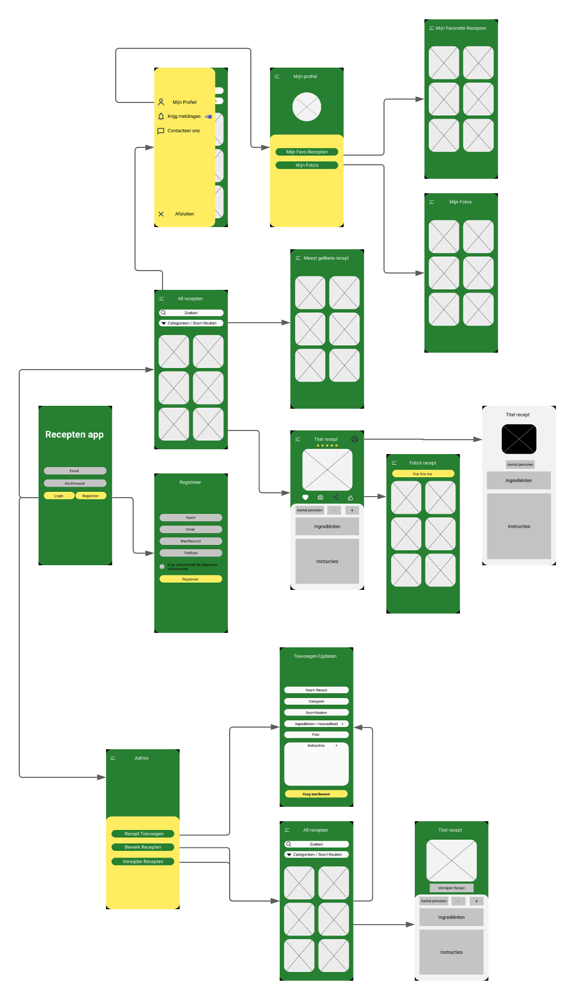

# Voorstel-MDE

## Recipe App

Deze app is bedoeld voor een bedrijf die hun eigen recepten kan in een app steken.

# Users

Een gebruiker zal zich kunnen inloggen en registreren.
De gebruiker zal kunnen recepten bekijken, toevoegen aan hun eigen favorieten. Een like geven aan een recept en ook een score geven aan de recepten.
Als de gebruiker op een specifiek recept geklikt heeft dan kan de gebruiker het aantal personen wijzigen. Als dit gewijzigd word dan wijzigen alle hoeveelheden ingredienten aan de hand van de gekozen personen. De stappen om dit gerecht klaar te maken zijn ook eveneens beschikbaar.
Het bekijken van de recepten zal gebeuren door te communiceren met een API.

### Optioneel

Wanneer de gebruiker beslist heeft welk recept hij/zij wilt klaar maken bestaat er een mogelijkheid om deze te kunnen afdrukken. Het recept zou dan worden om gezet naar een PDF bestand zo dat het kan afgedrukt worden.

# Admin

Een Admin zal kunnen recepten, categorieën, thema's, ingredienten en soort keuken kunnen toevoegen. En gebruikers kunnen bewerken.

# Mobile Development

## Layout

In de bijgevoegde wireframes kunt u zien hoe de app er in grote lijnen zou moeten uitzien. Deze kan in de loop van het project nog lichtjes afwijken.

## Native Services

* Gebruiker kan foto in app steken van zijn gemaakt recept
* Push notificatie bij een nieuw recept
* Trillen bij een verkeerde login (Optioneel)

## Wireframes 

